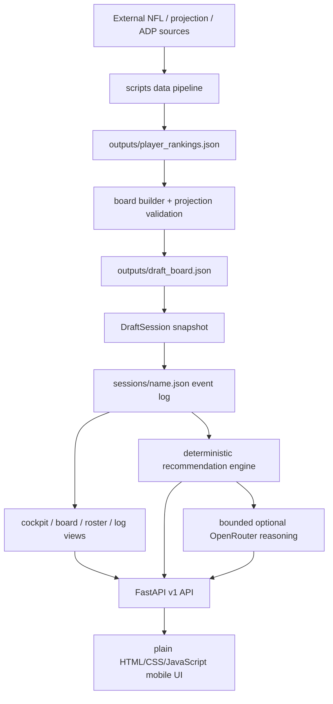

# Fantasy Draft Assistant Audit — 2026-08-01

## Scope and verification

This audit covered repository structure, state transitions, recommendation inputs, data provenance, security boundaries, tests, deployment scripts, and the rendered web experience. I ran the application against an isolated temporary sessions directory; no real draft session was changed.

Executed checks:

- `.venv\Scripts\python.exe -m pytest -q`: **138 passed, 3 failed, 6 skipped** in 17.84 seconds.
- `.venv\Scripts\python.exe scripts\cli.py --validate-board`: **NOT_READY**, exit 1, because `data/players_2026_positions_bye.csv` is absent.
- `.venv\Scripts\python.exe scripts\cli.py --smoke-test`: passed, despite the board validation failure.
- `.venv\Scripts\python.exe -m pip check`: no broken installed requirements.
- `.venv\Scripts\python.exe -m pip list --outdated --format=json`: only `nfl_data_py`, `pip`, and `pydantic_core` were reported behind in this environment; this is not a vulnerability scan.
- Live mock draft at 390×844 and 844×390: create, record, refresh, duplicate attempt, two-client stale mutation, backend stop/restart, and undo.
- Browser console: no warnings or errors during the tested flow.
- Warm local endpoint timing (five requests): health 16.1 ms average; cockpit 16.5 ms; full available board 14.7 ms; roster 16.2 ms; draft log 16.2 ms. The board response was 107,756 bytes.

Confirmed live behavior:

- Refresh restored the saved session and pick history.
- A duplicate player attempt was rejected without advancing the pick.
- Two different clients submitting pick 2 produced one success and one HTTP 409 stale-mutation response.
- Restarting the backend restored pick 3 from disk.
- Undo required confirmation, restored the player, and moved the current pick back exactly once.
- During an outage the last rendered draft state remained visible and the connection indicator changed to `Server lost`, but the notice only said `Failed to fetch`.

Not verified:

- Actual Tailscale Serve configuration, because the only deployment script is Bash/systemd-oriented and this audit host is Windows.
- A full 15-round phone simulation.
- True offline queueing (none is implemented); only outage detection and recovery were exercised.
- Keeper or traded-pick behavior, because those formats are not supported.
- A dependency CVE scan; `pip-audit` is not installed.

## A. Executive summary

### Overall assessment

The core draft-state engine is notably stronger than the average personal draft tool. It is event-backed, atomically persisted, reloadable, idempotent, stale-write aware, and explicit about destructive actions. The tested happy path and several failure paths worked. The application also keeps the optional model outside state mutation, which is exactly the right boundary.

The repository is **not ready to be the sole live-draft tool in its current checkout**. The supported startup validation fails because its projection source CSV is missing, while the direct FastAPI path and UI incorrectly report the same embedded board as ready. The emergency cheatsheet is also stale relative to the current board. Those contradictions make pre-draft readiness hard to trust.

### What it does well

- Durable, auditable JSON sessions with atomic replacement writes (`src/fantasy_draft/draft/session.py:89-102`).
- Serialized mutations, idempotency keys, expected-pick checks, atomic bulk catch-up, and stale undo protection (`src/fantasy_draft/draft/mutations.py:135-223`).
- Correct snake ownership formula and tested odd/even transitions (`src/fantasy_draft/draft/session.py:49-62`; `tests/test_draft_session.py:69-71`).
- Model output is constrained to a bounded, available-player allowlist and is read-only (`src/fantasy_draft/assistant/service.py:39-89`, `92-168`).
- The mobile cockpit puts clock state, one recommendation, draft confirmation, undo, search, and connectivity status in reach.
- Private deployment defaults are sensible: localhost bind, trusted hosts, same-origin mutation checks, request-size limits, CSP, and no CORS wildcard (`src/fantasy_draft/api/app.py:19-31`, `62-100`, `121-132`).

### Three largest risks

1. **Readiness has two contradictory answers.** CLI validation fails, but `/health`, board summary, session creation, and the UI trust stale embedded health and say Ready.
2. **The fallback plan is not current or reproducible.** The required raw projection file is absent, and the checked-in emergency sheet describes an older 10-team board while the active board is 8-team.
3. **Recommendation confidence exceeds the sophistication of the rules.** Fixed team tiers, fixed replacement baselines, round-independent need bonuses, and no deterministic bye/roster-limit handling can produce precise-looking but strategically brittle advice.

### Live-draft reliance and enjoyment

After fixing the readiness/fallback contradictions and completing one full phone simulation, the state engine is suitable for live use with a paper/static backup. Today, use it only with that fallback already verified and printed.

The UX generally enhances the draft: confirmation is clear, alternatives preserve choice, and clerical work is fast. The automatically generated “Draft plan” is the main enjoyment risk. It invokes the model without a tap when the user is within two picks and adds a second recommendation card, which makes the cockpit feel more prescriptive and crowded than a restrained co-pilot.

## B. System map

### Major components and entry points

- Frontend: framework-free HTML/CSS/JavaScript in `frontend/index.html`, `frontend/assets/app.css`, and `frontend/assets/app.js`. It has Cockpit, Board, Roster, and Draft log views plus native dialogs.
- Backend: FastAPI app factory and server entry point in `src/fantasy_draft/api/app.py:46-136`. Routes are in `src/fantasy_draft/api/routes/`.
- Draft state: `DraftSession` snapshots the board and appends selection/undo events in `src/fantasy_draft/draft/session.py:127-236`, `374-438`.
- Persistence: one JSON file per session; writes flush, `fsync`, and `os.replace` a uniquely named temporary file (`src/fantasy_draft/draft/session.py:89-102`).
- Mutation coordination: one in-process re-entrant lock per resolved session path (`src/fantasy_draft/draft/mutations.py:30-46`).
- Read models: `src/fantasy_draft/draft/cockpit.py` and `src/fantasy_draft/draft/views.py`.
- Recommendations: fixed deterministic scoring in `src/fantasy_draft/draft/recommendations.py`; model explanations in `src/fantasy_draft/assistant/` and OpenRouter transport in `src/fantasy_draft/providers/openrouter.py`.
- Ranking pipeline: substantial legacy/data-pipeline logic remains in `scripts/ranker.py`; reusable live domain logic is correctly under `src/fantasy_draft/`.
- Deployment: local `draft-server` entry point plus `scripts/draft-night-server`, which validates, starts a systemd user service, and configures Tailscale Serve.
- Authentication: none at application level; access control assumes localhost plus Tailscale Serve/tailnet membership.
- Tests: 147 collected tests, including six Selenium browser cases. Browser tests skip when Firefox is unavailable (`tests/test_browser_smoke.py:74-84`).

### Main state flow

1. A board is built from rankings and stores compact player evidence.
2. Session creation snapshots all board players, league settings, generation metadata, and source path.
3. Each selection or undo appends an event and atomically replaces the session JSON.
4. API mutations reload the latest file under a lock, apply idempotency/staleness checks, save, and return a new cockpit snapshot.
5. The browser stores only the last session name in local storage (`frontend/assets/app.js:462-474`); authoritative draft state remains server-side.

## C. Findings

### Critical

No confirmed critical data-loss or remote-code-execution defect was found. The state-corruption scenarios tested were handled correctly.

### High

#### H1. Direct server health and UI can report an invalid board as ready

- Why it matters: the user can bypass the checked launcher, create a live session, and see a green Ready indicator from a board that current validation rejects.
- Evidence: the board embeds `ready` (`outputs/draft_board.json:4-8` and its health block), while CLI validation returns `NOT_READY` because the referenced CSV is absent. `/health` only echoes embedded JSON health (`src/fantasy_draft/api/routes/health.py:34-43`); session creation checks embedded health only (`src/fantasy_draft/draft/session.py:183-185`); the UI displays `ready_snapshot` as Ready (`frontend/assets/app.js:285-289`). This was reproduced live: `/health` returned `ok`, and the UI created a session.
- Failure scenario: on draft night the developer runs `draft-server` directly, assumes the green indicators include current freshness/source validation, and drafts from an unverifiable artifact.
- Recommended fix: centralize runtime board validation and use it in health, board summary, and session creation. Distinguish `snapshot_valid`, `source_valid`, and `freshness` in the response instead of one Ready label.
- Effort: medium.

#### H2. The documented checked launch path is blocked in this checkout

- Why it matters: the safest documented startup command exits before the server starts.
- Evidence: `scripts/draft-night-server:44` runs board validation under `set -e`; validation returns exit 1 because `outputs/draft_board.json:8` references ignored/missing `data/players_2026_positions_bye.csv`. The README explicitly says not to start a `not_ready` board (`README.md:137-142`).
- Failure scenario: the first real startup attempt is made shortly before the draft; the launcher aborts and the user switches to the less safe direct server path without understanding the health discrepancy.
- Recommended fix: decide and document whether a deployable board must include its normalized source. Either package the required normalized artifact (if licensing permits) or embed a sufficient signed/hashed validation manifest so runtime validation does not depend on an intentionally ignored CSV. Add a clean-clone launch test.
- Effort: medium.

#### H3. The emergency fallback is stale and disagrees with the active board

- Why it matters: the manual recovery artifact is only useful if it matches the live rankings and league.
- Evidence: `outputs/emergency_draft_cheatsheet.md:7-16` says Ready, 10 teams, and an older generation time; the active board metadata says 8 teams and was generated later (`outputs/draft_board.json:4-8`). Regenerating the sheet from the current checkout produced NOT_READY.
- Failure scenario: the backend or Tailscale connection fails, and the user switches to a printed board with different league assumptions and older ordering.
- Recommended fix: generate the emergency sheet from the exact validated board during the preflight command; include a board fingerprint in both files and fail preflight if they differ.
- Effort: small.

#### H4. Recommendation scores encode stale and league-insensitive assumptions

- Why it matters: explanations and confidence look quantitative, but important assumptions are not tied to current league settings or season data.
- Evidence: fixed 2020s-era team buckets include WAS/CHI/NE below average and SEA poor (`scripts/ranker.py:60-71`); fixed replacement ranges ignore league size and starter counts (`scripts/ranker.py:74-80`, `1112-1150`); live scoring applies fixed bonuses/penalties regardless of round (`src/fantasy_draft/draft/recommendations.py:130-172`); only the top 40 overall available players are scored (`src/fantasy_draft/draft/recommendations.py:212-235`). Bye weeks are sent to the model but do not affect deterministic scoring.
- Failure scenario: in an 8-team league a fixed QB10–QB14 replacement baseline overstates elite-QB VORP; late in the draft the engine still adds the same starter-need bonus; a third QB can outrank a needed depth RB because roster caps/bench balance are absent.
- Recommended fix: derive replacement levels from league size/starters/flex, make roster and round policy explicit, remove static team tiers or source them from current projections, score all viable position leaders, and add deterministic bye-week warnings as explanation—not a large penalty.
- Effort: large.

### Medium

#### M1. The test suite is red and browser coverage silently skips

- Why it matters: there is no trustworthy pre-draft green gate.
- Evidence: failures are a missing `DraftSession` import (`tests/test_api.py:408`), an OpenAPI mutation allowlist not updated for `/assistant/strategy` (`tests/test_api.py:510`), and a board fixture now failing stricter source validation (`tests/test_draft_board.py:95`). Six Selenium cases skip when Firefox is missing (`tests/test_browser_smoke.py:74-84`).
- Failure scenario: a real regression is hidden among known failures, or mobile critical-path tests never run on the maintainer’s machine.
- Recommended fix: restore a fully green baseline, mark browser-test prerequisites as an explicit preflight failure or run them in CI with a provisioned browser, and add one command that reports unit, browser, board, and fallback status together.
- Effort: small.

#### M2. Automatic model strategy calls violate the restrained co-pilot goal

- Why it matters: merely approaching the user’s pick can transmit bounded draft context, incur latency/cost, and add a second recommendation without an explicit request.
- Evidence: `AUTO_STRATEGY_THRESHOLD = 2` and automatic call logic are at `frontend/assets/app.js:1`, `202-220`. In the live test a strategy request fired immediately at pick 1 for slot 3 and rendered Local fallback above alternatives.
- Failure scenario: a configured key is used on every nearby pick while the user only wanted silent tracking; a slow model competes with a time-sensitive UI and the repeated plan makes the assistant feel authoritative.
- Recommended fix: make strategy analysis opt-in by default, expose a persistent mode selector, and never auto-call an external model in Silent or “What am I missing?” mode.
- Effort: small.

#### M3. Multi-client protection is single-process only

- Why it matters: current concurrency guarantees fail if two server processes or workers point at the same sessions directory.
- Evidence: the coordinator explicitly provides an “in-process lock” (`src/fantasy_draft/draft/mutations.py:30-46`). Atomic replacement prevents torn files but cannot prevent two processes from loading the same revision and overwriting each other.
- Failure scenario: a second manually started server or future `--workers 2` deployment accepts conflicting pick 12 writes; the last replace wins and one event disappears.
- Recommended fix: document and enforce one worker now. If multi-process operation is ever needed, add an OS file lock or SQLite transaction with a revision compare-and-swap.
- Effort: small for enforcement/documentation; medium for cross-process locking.

#### M4. Application authorization is all-or-nothing at the tailnet boundary

- Why it matters: every tailnet user who can reach the service can create/delete sessions and mutate picks.
- Evidence: no route dependency authenticates a user; security controls are host/origin/request-size headers (`src/fantasy_draft/api/app.py:62-100`). Deletes are recoverable and confirmed in the UI, which reduces impact.
- Failure scenario: a family/shared-tailnet device opens the URL and accidentally advances or deletes the active draft.
- Recommended fix: for a personal app, add a simple server-generated draft-night token or Tailscale identity allowlist; keep localhost-only binding and current same-origin defenses.
- Effort: medium.

#### M5. Outage errors are technically correct but not actionable

- Why it matters: under a clock, `Failed to fetch` does not tell the user whether their last action saved or what to do next.
- Evidence: the API wrapper rethrows raw browser network errors (`frontend/assets/app.js:39-57`). Live outage test showed stale state plus `Server lost`, but the notice was exactly `Failed to fetch`.
- Failure scenario: connectivity drops after Record pick; the user taps again because save status is uncertain, creating confusion even though idempotency may protect the backend.
- Recommended fix: map network failures to “Server unreachable—last confirmed state is still shown; reconnect, then Refresh. Do not re-enter the pick until status is confirmed.” Keep the same request ID for retries.
- Effort: small.

#### M6. Landscape board navigation loses too much usable height

- Why it matters: phone rotation creates a frustrating, scroll-heavy view.
- Evidence: at 844×390 the fixed composer consumed 69 px and the sticky board heading 136 px; only part of the filter area remained above the composer. Rendering all 330 available players produced a 19,408 px document. At 390×844 there was no horizontal overflow and primary touch targets were good, but nav tabs and suggested prompts measured 38–40 px tall, below the common 44 px target (`frontend/assets/app.css:107-116`; prompts inherit smaller controls).
- Failure scenario: the user rotates the phone, must scroll within a narrow strip, and misses a position filter while picks are arriving.
- Recommended fix: collapse/hide the composer in non-Cockpit views or landscape, make the view heading more compact, raise all interactive targets to 44 px, and fetch/render one position at a time by default.
- Effort: medium.

#### M7. Board freshness and provenance are buried

- Why it matters: the user cannot tell at a glance whether rankings reflect late camp news, roster moves, or injuries.
- Evidence: the board was generated 2026-07-21 and its projection manifest retrieved data 2026-07-21; validation considers data stale after 14 days (`src/fantasy_draft/validation/projections.py:177-188`). The cockpit health UI only says Ready (`frontend/assets/app.js:285-289`); source appears only in player detail (`frontend/assets/app.js:449`). The board also records `news_source: none` and warns that 49 projections are ADP estimates and 10 players lack team/bye data.
- Failure scenario: the board crosses its 14-day limit or a player changes teams, but the phone still shows the same green Ready snapshot.
- Recommended fix: show `Board: Jul 21 · ESPN/ADP · no news` with warning count on the cockpit; show age and last successful validation, and turn the badge amber before it becomes blocking.
- Effort: small.

#### M8. Dependency and runtime contracts disagree

- Why it matters: clean installs are not reproducible and support claims are ambiguous.
- Evidence: README requires Python 3.12 (`README.md:97-106`), while `pyproject.toml:10` allows 3.9; the audit actually ran under 3.14. `requirements.txt` includes standard-library `argparse` plus browser/data/PDF packages not declared in project runtime dependencies (`requirements.txt:5-14`; `pyproject.toml:12-20`). Versions are lower-bounded rather than locked.
- Failure scenario: a future clean install resolves incompatible FastAPI/Pydantic/HTTPX combinations, or `pip install -e .` lacks tooling that documented scripts assume.
- Recommended fix: set one supported Python range, split runtime/dev/data/browser requirement groups, remove `argparse`, and commit a lock/constraints file for draft-night installs.
- Effort: medium.

#### M9. Deployment tooling does not match this Windows workspace

- Why it matters: the README includes PowerShell environment setup but the only checked private launcher assumes Bash, Linux paths, `systemctl`, and `systemd-run` (`scripts/draft-night-server:1-58`).
- Evidence: the audit host is Windows; the runbook’s operational instructions are Linux-centric (`docs/draft-night-runbook.md:6-24`).
- Failure scenario: the intended host is this Windows PC and the documented phone deployment cannot be executed natively on draft day.
- Recommended fix: either state that the draft host must be Linux or add a Windows PowerShell launcher/service workflow with equivalent localhost/Tailscale/Funnel checks.
- Effort: medium.

### Low

#### L1. Health reports “model configured” for any nonempty key

- Evidence: `bool(os.getenv("OPENROUTER_API_KEY"))` is the entire check (`src/fantasy_draft/api/routes/health.py:30`), and the frontend always treats the model badge as healthy even when it says Offline (`frontend/assets/app.js:287`).
- Scenario: an expired or placeholder key appears configured until the first request falls back.
- Fix: distinguish absent, configured-unverified, last-success, and last-failure. Do not make model health affect draft readiness.
- Effort: small.

#### L2. Duplicate identities can be silently collapsed during board construction

- Evidence: board construction deduplicates by normalized name within position and simply skips later records (`src/fantasy_draft/board/builder.py:181-195`); live player IDs are `position:normalized-name` (`src/fantasy_draft/draft/session.py:105-117`).
- Scenario: two same-position players with the same normalized name or a bad suffix normalization become one player without a health issue.
- Fix: carry stable source IDs where available and emit a blocking identity-collision issue instead of silently skipping.
- Effort: medium.

#### L3. Logging is sufficient for HTTP access, not rapid incident diagnosis

- Evidence: Uvicorn access logs exist, and event files retain request IDs, but the packaged API defines no structured application logger or correlation of HTTP errors to session/request IDs.
- Scenario: the user sees a 409/500 and must inspect raw JSON plus generic access logs to understand what happened.
- Fix: add concise structured mutation logs containing session, operation, expected/current pick, request ID, outcome, and latency; never log secrets or full assistant prompts.
- Effort: small.

### Positive observations

- Atomic write and reload behavior passed a real backend restart.
- Expected-pick and target-event checks are the right stale-client mechanism; a concurrent two-client test produced one success and one recoverable 409.
- Idempotency survives service-object recreation because keys are stored in the event log, not memory.
- Bulk catch-up uses a deep-copied preview and performs one save only after all selections resolve (`src/fantasy_draft/draft/mutations.py:158-200`).
- Session deletion moves JSON into recoverable `.trash` and is idempotent (`src/fantasy_draft/draft/mutations.py:90-132`).
- Model responses are constrained, validated, and marked stale if state changes while the request is in flight.
- Search, confirmation, undo wording, touch sizes for primary controls, no horizontal overflow, and visible connectivity/autosave indicators were strong at 390×844.
- Local endpoint latency was comfortably below live-draft needs; external model latency is off the critical mutation path.
- CSP, trusted hosts, localhost default bind, and same-origin mutation checks are proportionate protections for a personal Tailscale app.

## D. Live-draft readiness checklist

| Area | Assessment | Basis |
|---|---|---|
| Draft-state integrity | **Pass (single process)** | Event validation, atomic save, duplicate rejection, stale writes, and concurrency test passed. |
| Refresh recovery | **Pass** | Session name and state restored after reload. |
| Restart recovery | **Pass** | Backend restart resumed the exact saved pick. |
| Multi-client behavior | **Partial** | Works within one process; no cross-process lock. |
| Mobile usability | **Partial** | Strong portrait cockpit; landscape board and sub-44 px secondary controls need work. |
| Pick correction | **Pass** | Exact confirmed undo worked and preserved event history. Arbitrary historical correction is not supported. |
| Error visibility | **Partial** | Health indicators are clear; network copy and readiness truth are weak. |
| Data freshness | **Fail** | Runtime validation fails, direct health says Ready, and freshness is not shown. |
| Recommendation trustworthiness | **Partial** | Explainable/deterministic, but fixed assumptions and missing roster/round logic limit confidence. |
| Manual fallback | **Fail** | Emergency sheet is stale and current regeneration is NOT_READY. |
| Remote-access safety | **Partial** | Good localhost/Tailscale posture; no app identity control and Windows launch path is absent. |

## E. Prioritized roadmap

### Phase 1 — Must fix before a real draft

1. Make board readiness one authoritative runtime result; block creation when source/freshness validation fails.
2. Restore a reproducible projection artifact or change the validated-board portability contract deliberately.
3. Regenerate and fingerprint the emergency cheatsheet from the exact live board.
4. Return the test suite to green and ensure browser critical-path tests actually run.
5. Decide the supported host OS; verify the full Tailscale launcher on that host.
6. Run one complete league-length phone simulation with Wi-Fi/cellular transitions and a printed fallback beside it.

### Phase 2 — High-value improvements

1. Make model strategy opt-in and add Silent / Co-pilot / “What am I missing?” modes.
2. Replace fixed replacement baselines and team tiers with league-aware/current inputs.
3. Add deterministic roster-balance, round, and bye-conflict warnings.
4. Improve network uncertainty copy and preserve explicit retry state.
5. Compact landscape layouts and render a position-filtered board by default.
6. Add structured mutation logging and a one-command draft-night preflight.

### Phase 3 — Nice-to-have enhancements

1. Stable external player IDs and explicit identity-collision review.
2. Optional correction of an older pick through a reviewed replay operation.
3. Post-draft grade, roster construction review, and counterfactual analysis.
4. Optional live polling only if multi-device simulations show foreground-refresh is insufficient.
5. Keeper/traded-pick support only if the target league actually requires it.

## F. Proposed co-pilot UX

### Modes

- **Silent board tracking:** clock, search, recent picks, roster, undo, and health only. No recommendations or external calls.
- **Co-pilot (default):** one primary suggestion plus two alternatives; deterministic and visible only on/near the user’s turn.
- **What am I missing?:** no default player pick. On tap, show up to three warnings such as an imminent tier cliff, a roster imbalance, or an injury/data caveat.
- **Full recommendation:** deeper strategy card and optional model explanation, always user-triggered.
- **Post-draft analysis:** aggressive analytics, grades, and counterfactuals after the live event.

### Always visible

- Current pick/team, picks until user, round, connection, autosave, and board age/source.
- Search/record control, Undo, and Catch up.
- On the user’s turn in Co-pilot mode: one recommendation and two alternatives with position, tier, bye, and one-line rationale.

### Hidden until requested

- Full score components, player evidence, all 330 board rows, model prose, detailed roster analytics, and post-draft grades.

### Interruptions

Interrupt only for:

- Lost server connection or an uncertain mutation result.
- A stale confirmation because the draft advanced.
- Board/source freshness becoming unsafe.
- An active injury/inactive flag on the player currently being confirmed.
- A tier cliff when the user is on the clock and the signal is materially different from normal board value.

Do not interrupt merely because a model has an opinion, a position run occurred, or a bye week overlaps.

### Suggestion presentation

Show **three choices maximum**: one suggested player and two credible alternatives. Each should answer:

- Why now: value/tier/survival.
- Why this roster: starter/flex/depth context.
- What could be wrong: injury, ADP-estimated projection, stale/no-news data, or close score.

Use language such as “lean,” “best fit under these assumptions,” and “close alternative,” not “correct pick.” A persistent Hide assistant control should collapse the entire recommendation area for the draft, without disabling clerical tracking.

## G. Suggested tests

### Highest-value automated tests

1. Clean-checkout preflight: board validation, server health, session creation eligibility, and fallback fingerprint agree.
2. API health recomputes current validation rather than echoing embedded health.
3. Two different concurrent pick requests at the same expected pick yield one 200 and one 409.
4. Cross-process mutation test, or an explicit startup failure when configured with more than one worker.
5. Crash/restart after every mutation type: pick, bulk pick, undo, create, delete.
6. Corrupt/truncated session file returns a clear recovery error and does not overwrite the file.
7. Snake order across complete odd/even rounds for league sizes 8, 10, 12, including last pick and undo after completion.
8. Recommendation determinism under identical inputs and bounded change under one unrelated pick.
9. League-aware replacement tests for 8/10/12 teams, superflex if supported, and different starter counts.
10. Late-round roster construction: no third QB/TE recommendation over viable needed depth without an explicit value explanation.
11. Bye-week conflict is a warning, not a silent hard penalty; unknown byes remain unknown.
12. Stable identity tests for suffixes, apostrophes, same names, team changes, rookies, free agents, and position changes.
13. Browser tests at 320×700, 390×844, and 844×390 with every visible interactive target at least 44 px.
14. Browser outage test: failed mutation copy is actionable, state remains visible, reconnect refreshes, and retry is idempotent.
15. Browser critical path is required in the draft-night preflight rather than skipped when Firefox is absent.

### Highest-value manual rehearsal

1. Complete a full mock draft from the actual phone over Tailscale.
2. Lock/unlock and background/foreground the phone repeatedly.
3. Disable Wi-Fi/Tailscale immediately before and immediately after confirming a pick.
4. Restart the host service and then the host machine; verify session and Serve recovery.
5. Open a second client, race two picks, and confirm only one lands.
6. Use the emergency sheet for five picks and reconcile them through Catch up.
7. Rotate every major view and open each dialog with the mobile keyboard visible.
8. Verify the board source date, current teams, injuries/inactives, rookies, and top 50 players on draft day.

## H. Optional first patch plan — do not implement yet

### Goal

Eliminate false-green board readiness so every entry point gives the same answer.

### Exact files

- `src/fantasy_draft/api/routes/health.py`
- `src/fantasy_draft/api/routes/board.py`
- `src/fantasy_draft/api/routes/sessions.py`
- `src/fantasy_draft/board/builder.py` (only if extracting a shared runtime validation helper)
- `src/fantasy_draft/api/schemas.py`
- `frontend/assets/app.js`
- `tests/test_api.py`

### Intended behavior

- Runtime health recomputes validation from the configured board and its provenance instead of echoing embedded health.
- Health returns separate snapshot, source, and freshness statuses plus issues and validation time.
- Session creation is rejected with a recoverable structured error whenever authoritative readiness is not `ready`.
- The UI shows `Ready`, `Warning`, or `Blocked` with board age; it never calls an invalid snapshot simply Ready.
- The checked launcher, direct `draft-server`, API docs, and mobile UI agree.

### Test plan

1. Ready board/source returns 200 health and permits creation.
2. Missing source returns degraded health and blocks creation.
3. Stale manifest returns degraded health and blocks creation.
4. Embedded `ready` plus runtime-invalid source is blocked—the current regression case.
5. Existing sessions remain readable during a board-source failure because they own a snapshot; starting a new session is blocked.
6. Full pytest and browser smoke suite pass.

### Risks

- Runtime validation currently reads the projection CSV through pandas; doing it on every health request would be wasteful. Cache by board/source/manifest mtime or validate once at startup and on mtime change.
- Existing sessions should not become unreadable merely because the original board source disappears.
- If normalized source files are intentionally excluded for licensing, this patch exposes a deeper packaging decision that must be resolved rather than bypassed.

### Rollback

Revert the shared runtime-health helper and route/schema/UI changes as one focused commit. No session schema or persisted draft events need to change, so rollback is data-safe.
