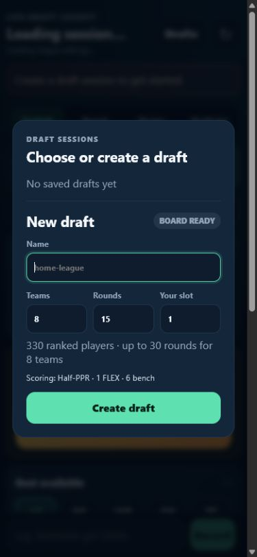
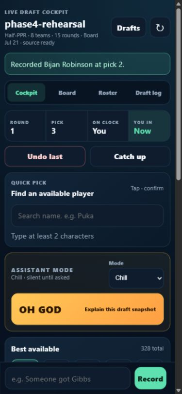
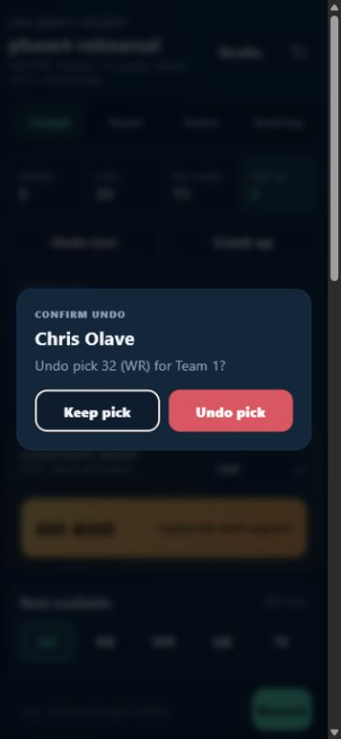
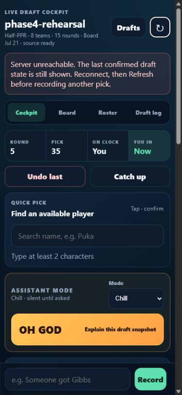
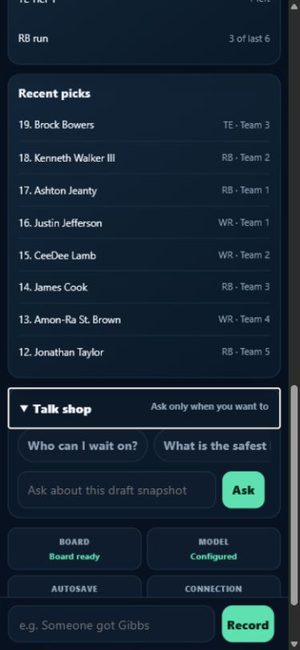
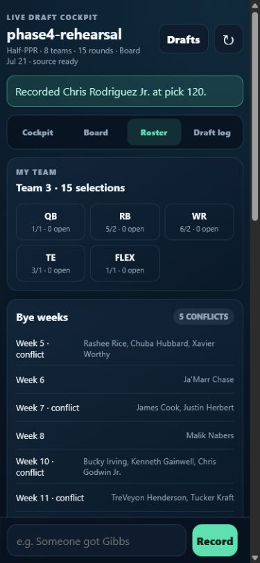
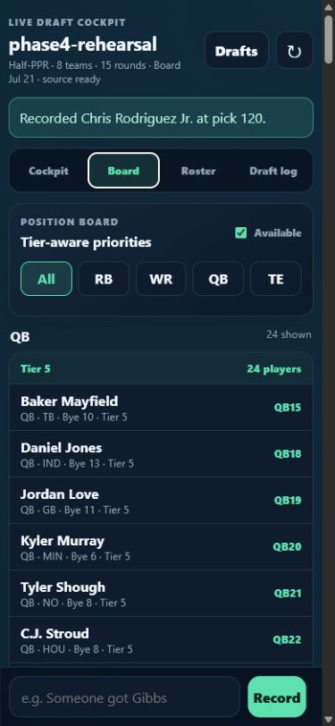
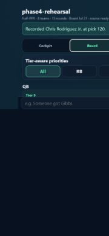
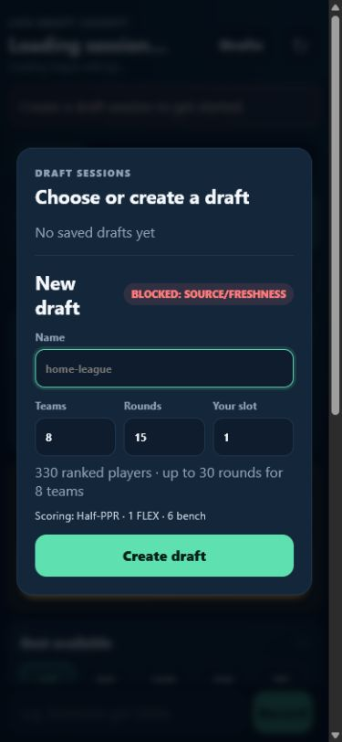

# Phase 4 browser draft simulation

## Executive verdict

**Launch recommendation: Rehearsal again after fixes.**

Tested commit: `d2397b047e9814ccebd14f11e5fdaaf1783222e8`

The application is close to being useful in a real draft, but it is not ready to be trusted for one yet. Pick entry, recovery, undo, Catch up, deterministic fallback, and basic orientation are strong. The cockpit is calmer and more enjoyable than the pre-Phase-4 interface, and a user can mostly ignore it between actions.

The blocker is stale advice: an OH GOD request started in one browser rendered as current after another browser had advanced the draft. The offline cheatsheet also uses a different ordering from the live board, even though its fingerprint and league settings match. Those are precisely the failure modes that matter when the room is moving quickly or the application is unavailable.

OH GOD is genuinely useful for a visible position run and during model failure. It is less reliable for a quiet board or a tier cliff: it can label a normal decision `HIGH`, and it names generic positional pressure without naming the cliff player, intervening teams, or cost of waiting.

The app generally makes the draft more fun rather than more distracting. The large yellow button is intentionally funny, easy to understand, and a generous 68 px tall on the tested phone viewport. Its repeated “THIS ONE IS CLOSE” treatment becomes less funny over a long draft, but the default Chill mode stays quiet until asked.

### Test environment and readiness

- Primary viewport: 390×844; additional viewports: 844×390 and 1280×800.
- Backend: documented `fantasy_draft.api.app`/`draft-server` entry point, one worker, loopback, isolated temporary sessions directory.
- Board: ready, 0 errors, 2 warnings, 330 ranked players in the session pool.
- Board and fallback fingerprint: `sha256:b53e828ed4432b84b5299369de02d809d3260e202da2770ffce61065c7700773`.
- Unit suite in preflight: 166 executed, 0 failed, 0 skipped.
- Browser critical path in packaged preflight: 8 skipped, so the official preflight result was `NOT READY` despite the artifact checks passing.
- Browser console: 0 warning/error entries across the three controlled tabs.
- Kicker and defense were not tested because the board and league contract support only QB/RB/WR/TE.
- The Linux/Tailscale host workflow was not run from this Windows host. Process-stop/restart recovery was exercised twice against the supported local workflow.

## Confirmed strengths

### Orientation and restraint

The first-launch dialog explains that there are no drafts, labels the board ready, exposes name/team/round/slot inputs, summarizes Half-PPR/FLEX/bench settings, and has one obvious Create draft action. Creation took approximately 458 ms.

Once open, the page makes Round, Pick, On clock, and You in visible together. The board date and `source ready` label appear immediately under the session name. The primary pick flow is consistently two taps after locating a player: Draft, then Record pick. A cancelled confirmation changes nothing.

The default is `Chill · silent until asked`. No model request was observed before an explicit OH GOD or Ask tap. Talk shop can be ignored completely.

### Mutation reliability

- Normal browser confirmations completed in approximately 329–342 ms in the sampled early and final picks.
- A scripted sample of 84 later mutations averaged 176.5 ms, with a measured range of 149.9–226.7 ms. Serialized response payloads averaged about 19.4 KB and peaked at about 21.6 KB.
- A double-click on the bottom Record control produced one confirmation dialog and no mutation.
- Two clients trying to act on pick 33 produced one saved pick. The stale client received: “The draft advanced after this pick was confirmed. Refresh and try again.”
- Replaying the request ID used for pick 34 returned `replayed: true`; the authoritative draft stayed at pick 121.
- Undo shows the exact player, overall pick, position, and team. Undo returned the player to the pool and the same player could be recorded again at the restored pick.
- Catch up previews the exact ordered teams/picks and states that the batch is atomic. Five emergency-sheet picks committed together in about 339 ms after an approximately 862 ms preview.

### Connectivity and recovery

After the backend stopped, the last confirmed state remained visible. After the request timeout, the interface changed Connection to `Server lost` and displayed:

> Server unreachable. The last confirmed draft state is still shown. Reconnect, then Refresh before recording another pick.

That wording is actionable and explicitly discourages an uncertain re-entry. A pick attempt made after the outage could not even reach confirmation because the detail lookup failed. An interrupted OH GOD request produced an equally clear unavailable message while pick tracking stayed visible.

A process kill immediately after Record still completed pick 35 and returned its confirmation before shutdown. Restarting the same isolated session directory recovered at pick 36. Request-ID replay separately confirmed that an uncertain retry cannot duplicate a landed mutation.

### Talk shop

Opening and closing the drawer is one tap. Reopening it in the same revision preserves the previous question and answer; a draft-state refresh clears the answer rather than presenting it as current. It sits below recent picks, so it does not compete visually with the fixed pick composer.

Observed model timings shown by the UI were 1.4–2.4 seconds. Answers about the room, ADP deviation, roster weakness, and tight-end timing were concise and grounded in current pick counts, roster slots, and bye weeks. “Can I wait on tight end?” correctly recognized that Brock Bowers had already filled the starting TE slot.

### Full draft and fallback

The 8-team, 15-round draft completed at pick 120 with a clear Draft complete panel. The long run included early QB and later TE runs, value picks, reaches, falling players, three undo/correction cycles, late QB/TE selections, and bench filling. Cockpit DOM size remained bounded at 469 elements before the last pick, and there was no horizontal overflow at 390 px.

The emergency sheet matched the live board fingerprint and the 8-team Half-PPR/FLEX/6-bench settings. After five mock offline selections, Catch up restored all five in the intended snake order and resumed at pick 6 without corruption.

## Findings by severity

### Confirmed defects

#### High — OH GOD can render a response for an obsolete draft revision

- **Workflow:** Chaotic input; OH GOD while another browser records a pick.
- **Reproduction:** Open `phase4-rehearsal` in two clients at pick 34. Tap OH GOD in client A. Before the response returns, record Kyren Williams at pick 34 through client B. Observe client A.
- **Expected:** The response is discarded or visibly marked stale after comparison with the authoritative server revision.
- **Actual:** Client A remained visually at pick 34 and rendered Breece Hall/Jalen Hurts/Javonte Williams as a normal current situation card after the server had advanced to pick 35. No revision is displayed to let the user detect the mismatch.
- **Evidence:** The concurrent pick API returned pick 34 and the next authoritative cockpit was pick 35; client A then rendered a normal `MEDIUM` card for its old local snapshot. Mutation confirmations do correctly reject this same stale state.
- **Likely cause:** Assistant freshness is compared with client-local state, which does not change when another client mutates the session. The response path does not re-read authoritative state immediately before rendering.
- **Recommended fix:** Before rendering any assistant response, fetch/compare the current server revision. Replace the card with `THE DRAFT MOVED` when it differs. Show the analyzed pick/revision in the card metadata for auditability.
- **Estimated effort:** Medium (one frontend freshness guard plus race-focused browser tests).

#### High — Emergency-sheet “overall priorities” disagree with the live board order

- **Workflow:** Emergency fallback and Catch up.
- **Reproduction:** Compare the fresh cockpit/board top five with `outputs/emergency_draft_cheatsheet.md`.
- **Expected:** A fallback described as the matching board should preserve the same default priority order, or unmistakably explain that it is a different view.
- **Actual:** Live order begins Gibbs, Bijan, Chase, Puka, McCaffrey. The sheet’s “Overall Priorities by VORP” begins Gibbs, Bijan, Puka, Jonathan Taylor, Chase. The fingerprint and league settings still match.
- **Evidence:** The offline mock followed the sheet and therefore selected Puka at 3 and Taylor at 4, while the live UI would have shown Chase and Puka ahead of Taylor.
- **Likely cause:** The sheet re-sorts the exact board payload by source VORP instead of preserving the board’s `blended_score_then_vorp_then_source_rank` order.
- **Recommended fix:** Use the live board order for the default offline list. If a VORP-only table remains, label it as a secondary analytical view, not “Overall Priorities.”
- **Estimated effort:** Small.

#### Medium — Quiet-board OH GOD still declares a high-pressure decision

- **Workflow:** Situation C, pick 3 with two normal RB selections and no active run.
- **Reproduction:** Create an 8-team session at slot 3, record Gibbs and Bijan, then tap OH GOD.
- **Expected:** Say the board is stable and avoid urgency.
- **Actual:** The headline was “THIS ONE IS CLOSE. YOU ARE NOT MISSING A SECRET,” but the badge was `HIGH` and the card said `Can wait: no`.
- **Evidence:** The cockpit itself showed no active position run. The card cited generic TE pressure while offering three first-round RB/WR choices.
- **Likely cause:** Confidence/urgency derives from player survival and global tier flags, even when the current situation has no emergency signal.
- **Recommended fix:** Separate recommendation confidence from emergency severity. Use a stable/low-urgency state when there is no active run, no candidate-specific cliff, and several close options.
- **Estimated effort:** Small to medium.

#### Medium — Tier-cliff advice does not explain the cliff

- **Workflow:** Situation B after eleven Tier-1 RB selections.
- **Reproduction:** Leave one Tier-1 RB, put the user on the clock at pick 12, then tap OH GOD.
- **Expected:** Name the last RB, say why the tier matters, identify the teams drafting before the next user turn, and state what waiting loses.
- **Actual:** The card only said “The clearest tier pressure is at RB/TE.” Its three choices were all WRs. It did not name the remaining RB, intervening teams, or projected drop.
- **Evidence:** The cockpit simultaneously showed `RB Tier 1 · 1 left` and an RB run of 6/6.
- **Likely cause:** Global tier alerts are appended to a candidate set chosen by total recommendation score; the explanation is not built from the actual cliff object.
- **Recommended fix:** When a tier is called out, bind the explanation to the last player in that tier, the next tier baseline, and the snake teams/picks before the next user turn. Do not cite a cliff that none of the choices addresses.
- **Estimated effort:** Medium.

#### Medium — Late recommendations create avoidable positional excess

- **Workflow:** Full 15-round draft while accepting the primary recommendation for most picks.
- **Reproduction:** Start with Brock Bowers in round 3, then continue accepting the primary recommendation except for the documented run/reach injections.
- **Expected:** Once the TE starter and reasonable depth are filled, late recommendations should prioritize useful bench diversity.
- **Actual:** The primary path selected Tucker Kraft in round 9 and Mark Andrews in round 14, ending with 3 TEs, 1 QB, 5 RBs, and 6 WRs. The final needs model itself labels TE as excess. The roster also accumulated five bye-week conflict groups.
- **Evidence:** Final roster screenshot and `/roster`: TE `3/1`, with Brock Bowers, Tucker Kraft, and Mark Andrews.
- **Likely cause:** Player value can still overcome the excess-position penalty, and bye conflicts remain only caveats rather than meaningful late-round construction constraints.
- **Recommended fix:** Increase or harden excess penalties after depth targets are met, especially for non-FLEX TE/QB bench slots, while retaining an explicit exceptional-value escape hatch.
- **Estimated effort:** Medium.

#### Medium — Model health says Configured for a known-invalid key

- **Workflow:** Situation E, invalid model configuration.
- **Reproduction:** Restart with a non-empty invalid `OPENROUTER_API_KEY`, refresh, and tap OH GOD.
- **Expected:** Health should distinguish usable, unverified, and offline/failed configuration.
- **Actual:** The health badge remained `Configured`; the request failed and the card correctly disclosed deterministic fallback.
- **Evidence:** Fallback returned in approximately 551 ms with “Model interpretation unavailable,” while health still said Configured.
- **Likely cause:** Health checks only whether the environment variable is non-empty.
- **Recommended fix:** Rename the passive badge to `Key present` or cache a bounded provider validation result and surface `Model unavailable` after an authentication failure.
- **Estimated effort:** Small.

#### Medium — Stale OH GOD chrome remains interactive after draft completion

- **Workflow:** Finish pick 120 after an open late-round OH GOD card.
- **Reproduction:** Open OH GOD at pick 120, record the final pick, and inspect the completed cockpit.
- **Expected:** Remove or fully disable assistant follow-ups when the draft ends.
- **Actual:** The main OH GOD button disabled, but the old card remained as `THE DRAFT MOVED` and its Can I wait?/Why not safe?/More upside buttons remained enabled.
- **Likely cause:** Completion disables the primary action but does not clear or disable the prior response subtree.
- **Recommended fix:** Clear the response on completion or replace it with the Draft complete panel only.
- **Estimated effort:** Small.

### Subjective UX concerns

#### Medium — The full board is too large for draft-night scanning

- **Workflow:** Board view late in the full draft.
- **Observation:** With 210 players still available, the portrait board measured 12,278 CSS px tall, 1,879 DOM elements, and 283 buttons. It had no horizontal overflow, but reaching later positions requires extensive scrolling. Landscape preserved roughly the same 12,114 px document in only 390 px of height.
- **Expected:** A quick board view that can be scanned without rendering every deep player at once.
- **Actual:** The interface feels like a control panel here, especially in landscape. The fixed composer further reduces useful vertical space.
- **Recommended fix:** Prefer deleting deep-list friction: default to a bounded top set per position/tier with an explicit progressive reveal, while preserving search and filters.
- **Estimated effort:** Medium.

#### Low — Board freshness failure is not explained in human terms

- **Workflow:** New draft against an isolated source fixture older than the 14-day policy.
- **Observation:** Creation is correctly disabled, but the dialog only says `BLOCKED: SOURCE/FRESHNESS`. It does not show the source date, age, or next action.
- **Recommended fix:** Replace the combined code-like label with one sentence such as “Projection data is 62 days old; refresh the board before creating a draft.”
- **Estimated effort:** Small.

#### Low — “Talk me out of the player” invents a player

- **Workflow:** Talk shop with the exact prompt “Talk me out of the player I am considering.”
- **Observation:** With no selected-player context, the answer assumed De'Von Achane, argued against him, and still displayed `Recommendation: De'Von Achane`.
- **Recommended fix:** Ask which player, or only infer a player when an explicit, visible considering-player state exists.
- **Estimated effort:** Small.

#### Low — Duplicate and typo feedback is accurate but not especially human

- A duplicate `someone got Gibbs` returned “No available player matched 'Gibbs'” rather than “Gibbs was already drafted at pick 1.”
- `Brokk` returned “No available players match” with no fuzzy correction; correcting to `Brock` immediately found Bowers and Purdy.
- Recommended fix: distinguish unavailable exact/unique matches from unknown names; fuzzy suggestions are optional and should not add another confirmation step.

#### Low — Some frequently used touch targets are 40 px tall

- Cockpit/Board/Roster/Draft log tabs measured 40 px at 390×844. Drafts, Undo, Catch up, Talk shop, and OH GOD were 44 px or larger.
- Recommended fix: raise the four view tabs to 44 px without adding visual weight.

## Friction log

| Moment | Taps / scroll | Observation |
| --- | ---: | --- |
| Create first draft | 1 tap after filling | Clear and direct. |
| Visible player pick | 2 taps | Draft → Record pick; confirmation is worthwhile. |
| Search player pick | 2 taps after typing | Search result → Record pick; no extra sheet. |
| Cancel wrong player | 2 taps | Draft → Cancel; state stayed unchanged. |
| Undo | 2 taps | Undo last → Undo pick; exact target is shown. |
| Catch up five picks | 3 taps | Catch up → Preview → Record all; justified by atomicity. |
| External-client change | 1 tap | Manual Refresh is required; stale mutation copy clearly asks for it. |
| Talk shop question | 2 taps plus typing | Open drawer → Ask. Repeated questions need only Ask while open. |
| Reopen Talk shop | 1 tap | Same-revision context is preserved. |
| Misspelled search | correction required | No suggestion for `Brokk`. |
| Duplicate pick | no mutation | Message does not say where/when the player was drafted. |
| Portrait cockpit | some scroll | On-clock status and composer are simultaneously visible; lower roster/recent details require scrolling. |
| Portrait full board | excessive scroll | 12,278 px document with 210 available players. |
| Landscape full board | excessive scroll | Very little content fits above the fixed composer. |
| Completed draft | 1 tap | View roster/View draft log actions are obvious, but stale assistant follow-ups remain. |

## OH GOD assessment

| Scenario | Grounding | Helpfulness / choice quality | Brevity / humor | Confidence | Latency |
| --- | --- | --- | --- | --- | ---: |
| Early QB run | Correctly saw five QBs in the recent window and avoided chasing | Strong: Gibbs/Bijan/Chase framed as lean/safe/upside | Understandable in under 10 seconds; headline worked | `HIGH` is defensible; fallback disclosed | ~2.17 s |
| Tier cliff | Saw RB/TE pressure but did not bind it to the final RB | Weak: all three choices were WRs and no intervening teams/loss were named | Brief but incomplete | `HIGH` without actionable cliff detail | ~2.27 s |
| Normal board | Current player choices were available | Weak: normal board still became `HIGH`/Can wait no | Headline was calm; badge was not | Overstated urgency | Fallback completed within the five-second UI bound |
| Weak data | Board row exposed `Bye —`; global caveat codes were present | Weak: no candidate-specific human caveat or visible confidence reduction | Concise but codes read like diagnostics | `MEDIUM`; not clearly reduced for incomplete data | ~2.06 s |
| Model invalid | Deterministic state remained authoritative | Useful three-choice fallback; pick tracking unaffected | Clearly labeled as deterministic fallback | Transparent about model unavailability | ~0.55 s |
| Late round | Correctly said no later user pick remained | Reasonable low-stakes options; can-wait became not applicable | Repeated close-decision joke had worn thin | `LOW`, appropriately calm | ~0.54 s |

Every inspected non-stale choice corresponded to an available player in the contemporaneous board/cockpit. The UI does not display the analyzed revision, so the requested visible revision check cannot be completed from the rendered card. The concurrent-client reproduction proves this omission is material.

## Draft enjoyment assessment

- **Did the assistant create interesting decisions or remove them?** Mostly created them. Lean/safe/upside is a useful framing and preference picks never received scolding. It becomes less interesting when all three options share one position or when global tier pressure is unrelated to the choices.
- **Did it speak only when useful?** Yes by default. Chill mode made no unsolicited model calls. Old response cards speak too long after their useful life, especially after completion.
- **Did humor improve the experience?** Yes initially. `THE ROOM IS RUNNING. YOU DO NOT HAVE TO SPRINT.` is good draft-night copy. The repeated close-decision headline becomes canned over several calls.
- **Did the app ever feel like operating a control panel?** The cockpit generally did not. The 12k-pixel full board and dense final roster did.
- **What should be removed rather than improved?** Remove stale response chrome, completed-draft follow-ups, and the default rendering of hundreds of deep board rows. Do not add more health controls or more persistent assistant panels.

## Visual review

- No horizontal overflow was observed at 390×844, 844×390, or 1280×800.
- OH GOD looks deliberate: high contrast, restrained surrounding border, 68 px touch height, and plain-language subtitle.
- The fixed composer keeps Record reachable but consumes meaningful landscape height.
- Four main view tabs are slightly undersized at 40 px; primary mutation controls are 44 px or larger.
- Keyboard obstruction could not be measured reliably with the in-app browser automation surface; textbox focus and search remained usable, and no layout shift error appeared in the console.
- The completed roster is readable but begins with five bye-conflict groups, which makes the result feel less successful than the clean visual treatment suggests.

## Smallest prioritized patch list before another rehearsal

1. Add an authoritative post-response revision check for OH GOD/Talk shop and suppress stale results; display analyzed pick/revision.
2. Make the emergency sheet preserve the live board’s default order.
3. Split emergency severity from recommendation confidence so a normal board can explicitly be stable.
4. Bind tier-cliff copy to the actual remaining player, next-tier loss, and teams before the user’s next turn.
5. Prevent late primary recommendations from producing positional excess after depth targets are filled.
6. Clear/disable stale assistant response controls on draft completion.
7. Rehearse again with browser critical-path tests executing rather than skipped.

The remaining items—model badge wording, freshness copy, full-board progressive rendering, duplicate wording, and 44 px view tabs—are worthwhile minor fixes but should not displace the stale-response and fallback-order work.
